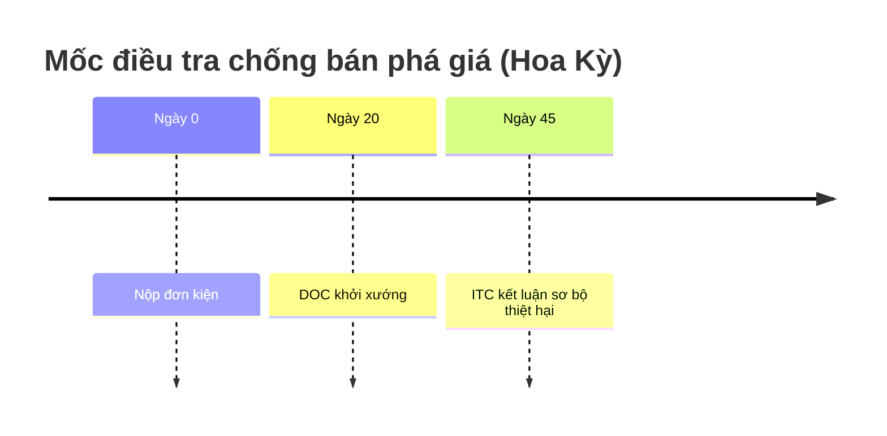
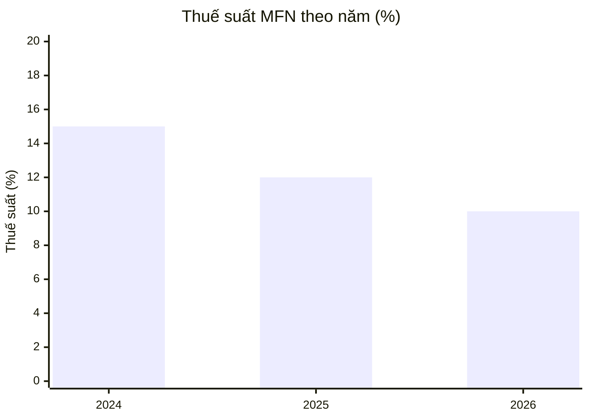

# Hình minh hoạ trong câu trả lời

## 1. Khi nào nên có hình
Chỉ khi hình giúp hiểu nhanh hơn chữ:
- **quy trình / thủ tục nhiều bước, nhiều bên** (khởi kiện, điều tra chống bán phá giá, thủ tục hải quan, giao kết – thực hiện hợp đồng) → sơ đồ;
- **trình tự trao đổi** (luồng L/C, nhờ thu, chứng từ) → sơ đồ `sequence`;
- **mốc thời hạn** (timeline điều tra, thời hiệu) → ```mermaid `timeline` hoặc `gantt`;
- **cơ cấu các bên / quan hệ sở hữu** → sơ đồ `architecture`;
- **so sánh số liệu** (thuế suất theo năm, biên độ phá giá của các bị đơn) → ```mermaid `xychart-beta` (cột / đường) hoặc bảng markdown;
- **cho xem văn bản gốc** (trang án lệ, bảng thuế, điều luật trên vbpl) → `source_snapshot`;
- ảnh thật của cơ quan / mẫu biểu chính thức chỉ khi người dùng cần nhận diện nó.
Không vẽ cho câu trả lời ngắn, câu hỏi định nghĩa, trò chuyện, hay khi người dùng không cần. Người dùng yêu cầu "vẽ sơ đồ" → luôn vẽ.

## 2. Công cụ nào
| Nhu cầu | Cách làm |
|---|---|
| Sơ đồ đẹp, kiểm tra bố cục, tải PNG/SVG | `diagram_create` theo skill `archify` → chép dòng `[[diagram:<mã>]]` |
| Sơ đồ / biểu đồ nhẹ, timeline, biểu đồ cột | khối ```mermaid (xem §4) viết thẳng trong câu trả lời |
| Ảnh minh hoạ | `image_search` (official / commons) → `image_fetch(url)` → chép 2 dòng markdown trả về |
| Ảnh chụp nguyên bản trang / trang PDF chính thức | `source_snapshot(url_or_doc, page?, region?)` → chép 2 dòng markdown trả về |
- Người dùng yêu cầu **"vẽ sơ đồ / lưu đồ / quy trình"** → PHẢI gọi `diagram_create` (skill `archify`, chép mẫu IR `workflow` rồi thay nội dung). Mermaid chỉ dùng cho timeline / biểu đồ số liệu, hoặc khi `diagram_create` đã lỗi 2 lần.
- **Không bao giờ tự viết** `[[diagram:…]]` hay `visual:…`: mã chỉ có trong kết quả công cụ (dạng `v` + 14 chữ số + `-` + 6 ký tự). Marker tự đặt không hiển thị gì.
- Nội dung trong hình (bước, thời hạn, số liệu) là nội dung pháp lý như chữ: **tra nguồn trước** (skill `legal-research` / `verify-unknown`), không vẽ theo trí nhớ; không tra được thì nói rõ và chỉ vẽ phần đã xác minh.
Archify lỗi sau 2 lần sửa → dùng mermaid. Không có ảnh phù hợp → bỏ ảnh, không thay bằng ảnh khác "gần giống".

## 3. Đặt hình
- Đặt hình **ngay sau đoạn văn nó minh hoạ** (VD: đoạn "Quy trình gồm 5 bước…" → sơ đồ → giải thích từng bước). Không dồn hình cuối câu trả lời, không mở đầu bằng hình.
- **Tối đa ~3 hình** mỗi câu trả lời; mỗi hình một ý.
- Chép **nguyên văn** marker / markdown công cụ trả về (`[[diagram:v…]]` trên một dòng riêng; `` + dòng *Ảnh: … – giấy phép, nguồn …*). Không tự đặt mã, không sửa link `visual:`.
- **Không bao giờ** chèn ảnh bằng link ngoài (``) – giao diện không hiển thị ảnh ngoài; chỉ ảnh đã qua `image_fetch` / `source_snapshot`.
- Nhãn trong hình và chú thích dùng **ngôn ngữ câu trả lời**. Nguồn / căn cứ pháp lý vẫn ghi trong phần chữ (link đã mở), hình không thay trích dẫn.

## 4. Mermaid (hiển thị ngay trong giao diện)
Viết khối code với ngôn ngữ `mermaid`. Giữ đơn giản (≤ 15 nút), nhãn ngắn, đặt nhãn có dấu câu / ngoặc trong `"…"`. Không dùng `click`, `href`, `%%{init}%%`, HTML trong nhãn (không `<br/>` – xuống dòng không cần thiết); mọi chữ của một nút nằm TRONG dấu ngoặc của nút (`B{"ITC sơ bộ – 45 ngày"}`), không viết gì sau dấu đóng ngoặc. Sai cú pháp → giao diện chỉ hiện mã.


Cũng dùng được `flowchart LR` (A["Nộp đơn"] --> B{"Đủ điều kiện?"}), `sequenceDiagram`, `gantt`, `pie`. Số liệu trong biểu đồ phải lấy từ nguồn đã tra / tính bằng `calc_*`.

## 5. Ảnh – nguồn được phép
- **Chỉ** (a) tên miền chính thức (gov.vn, vbpl.vn, WTO, EU, USITC, Federal Register…) và (b) Wikimedia Commons với giấy phép CC0 / public domain / CC BY / CC BY-SA – công cụ tự lọc và ghi công. Không ảnh stock, ảnh báo chí, ảnh mạng xã hội.
- Chú thích mô tả **đúng** nội dung ảnh (đọc mô tả Commons); không suy diễn ("trụ sở ITC" chỉ khi ảnh đúng là trụ sở ITC).
- **Không bao giờ** tạo / mô tả "ảnh văn bản" không có thật; muốn cho xem văn bản thì `source_snapshot` trang chính thức đã dùng làm căn cứ.
- Ảnh CC BY / CC BY-SA bắt buộc giữ dòng ghi công tác giả + giấy phép.
