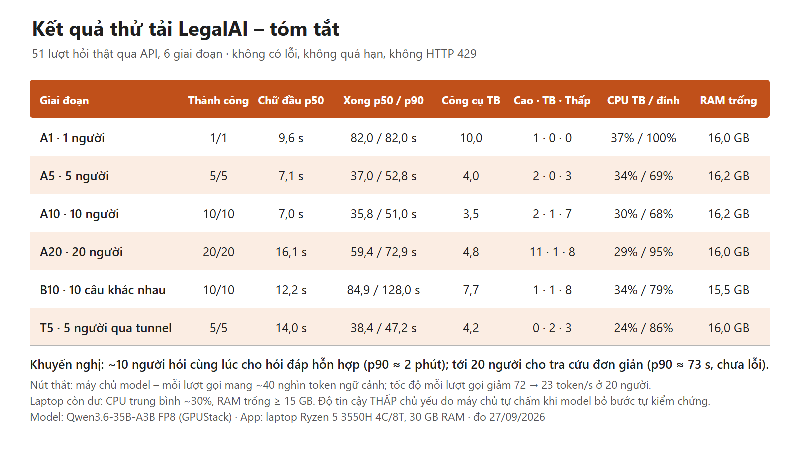
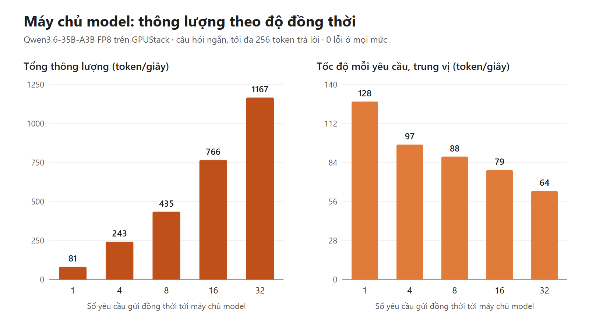
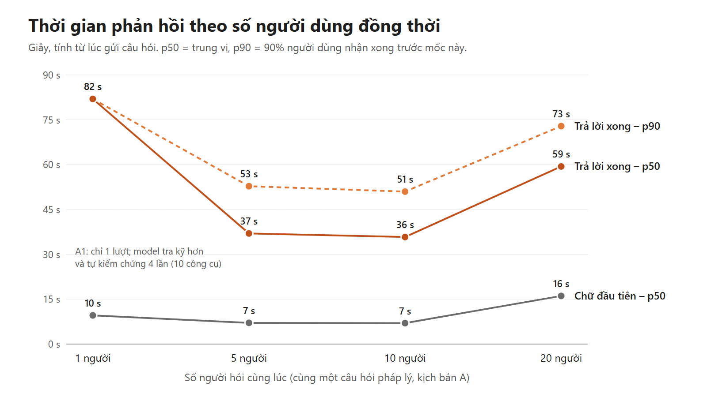
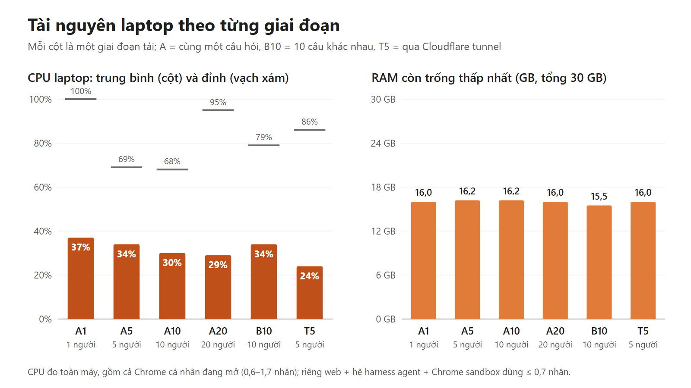
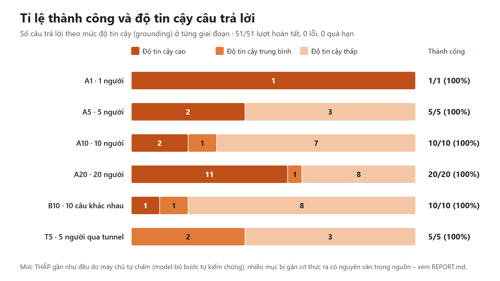

# Báo cáo thử tải LegalAI (bản chạy thật): 27/09/2026

Đo lúc 20:28–20:41 (GMT+7) trên bản web đang chạy thật. Số liệu gốc nằm ở `raw/`, bản tổng hợp ở `results.json`, biểu đồ ở `charts/`,
ảnh bảng tóm tắt để chèn slide là `summary-slide.png`.

## 1. Tóm tắt

- **51/51 lượt hỏi hoàn tất**: không lỗi, không quá hạn, không gặp HTTP 429, không phải dừng sớm ở giai đoạn nào (6 giai đoạn, cao nhất 20 người hỏi cùng lúc).
- **Nút thắt là máy chủ model, không phải laptop.** Khi có 10 lượt chạy cùng lúc, máy chủ model đã bão hoà: tổng token đầu ra/giây gần như
  không tăng khi lên 20 người (207 → 194 token/s), còn tốc độ của từng lượt gọi model giảm từ 72 xuống 23 token/s. Trong cùng lúc đó laptop
  chỉ dùng khoảng 30% CPU và luôn còn trống ít nhất 15,5 GB RAM.
- **Khuyến nghị**: tối đa khoảng **10 lượt hỏi đồng thời** với hỏi đáp pháp lý hỗn hợp (p90 ≈ 2 phút). Với câu tra cứu đơn giản có thể lên
  **20 lượt đồng thời** (p90 ≈ 73 s). Mức 20 là mức cao nhất đã thử, chưa phải giới hạn đã xác định.
- **Độ tin cậy**: khi chạy đồng thời, số câu bị chấm THẤP nhiều hơn hẳn (A1 cao; A10 có 7/10 thấp; B10 có 8/10 thấp). Nguyên nhân chính không nằm
  ở chỗ nội dung trả lời kém đi. Có hai lý do: (1) model bỏ qua bước tự kiểm chứng, nên máy chủ phải tự chấm và không còn lượt sửa;
  (2) bộ kiểm chứng so khớp nguyên văn rất khắt khe, nên gắn cờ cả những đoạn trích đúng nguyên văn. Chi tiết ở mục 6.

## 2. Phần cứng và cấu hình

| Thành phần | Cấu hình |
|---|---|
| Máy chạy ứng dụng | Laptop AMD Ryzen 5 3550H (4 nhân / 8 luồng), 30 GB RAM, Windows 10 Pro |
| Tiến trình trên laptop | Web server (Node), hệ harness agent, Chrome sandbox (trình duyệt tra cứu của agent), Chrome OCR, cloudflared |
| Model | Qwen3.6-35B-A3B FP8 trên máy chủ GPUStack riêng (`gpustack.chimai.io`), gọi qua mạng |
| Truy cập từ ngoài | Cloudflare quick tunnel (`*.trycloudflare.com`) |

Laptop cũng là máy làm việc cá nhân. Trong lúc đo, Chrome cá nhân (28–37 tiến trình, khoảng 3,5–4 GB) vẫn mở và dùng 0,6–1,7 nhân CPU,
tức nhiều hơn cả web, hệ harness agent và Chrome sandbox cộng lại. Vì vậy CPU toàn máy trong các bảng dưới đây **cao hơn** mức hệ thống thực sự cần.

## 3. Phương pháp

- **Người dùng giả lập**: 20 tài khoản thử `loadtest-01…20`, tạo qua API quản trị và đã xoá sau khi đo (mục 9). Mỗi người dùng là một client HTTP
  riêng: đăng nhập, `POST /api/chats` với câu hỏi, rồi long-poll `/api/chats/:id/poll` giống giao diện chạy sau tunnel. Lượt được tính là xong khi
  nhận sự kiện `idle` và `/messages` báo `busy=false`. Các người dùng vào cách nhau 0,3 s. Nếu agent hỏi lại để làm rõ, client tự chọn phương án đầu tiên.
- **Chỉ số đo**
  - *Chữ đầu tiên*: thời điểm xuất hiện sự kiện đầu tiên (bước công cụ hoặc chữ).
  - *Trả lời xong*: thời điểm lượt chạy kết thúc.
  - *Công cụ*: số lần gọi công cụ, lấy từ lịch sử chat.
  - *Độ tin cậy*: verdict grounding cuối cùng của lượt, gồm cả nguồn chấm (model tự chấm hay máy chủ chấm).
  - *Token*: đọc từ CSDL của hệ harness agent.
  - *Tài nguyên*: CPU, RAM trống và RAM theo nhóm tiến trình, lấy mẫu khoảng 1–2 s/lần bằng PowerShell.
- **Ngưỡng dừng an toàn**: RAM trống < 3 GB, có HTTP 429, hoặc tỉ lệ lỗi > 30%. Không giai đoạn nào chạm các ngưỡng này.
- **Kịch bản**
  - *A* (A1/A5/A10/A20): cùng một câu hỏi "Mức phạt vi phạm hợp đồng thương mại tối đa là bao nhiêu theo Luật Thương mại 2005?", chạy với 1/5/10/20 người, gọi thẳng vào máy (`127.0.0.1:3000`).
  - *B10*: 10 câu khác nhau (phạt vi phạm, huỷ hợp đồng, thời hiệu, án lệ, phòng vệ thương mại thép, lãi chậm trả, thuế HS/EVFTA, soạn hợp đồng ngắn, hiệu lực hợp đồng, trọng tài nước ngoài).
  - *T5*: kịch bản A với 5 người, đi qua Cloudflare tunnel.
  - *Đo riêng máy chủ model* (`gpuprobe`): 1/4/8/16/32 yêu cầu gửi thẳng tới model, câu ngắn, tối đa 256 token trả lời.
  - *Kịch bản C* (soạn hợp đồng dài 15 điều): **không đo**. Lượt chạy thử với 3 người bị dừng giữa chừng nên không có số liệu tổng hợp. Dữ liệu dở dang đã được xoá cùng các tài khoản thử.

## 4. Kết quả từng kịch bản

Thời gian tính bằng giây (s). "Công cụ TB" là số lần gọi công cụ trung bình mỗi lượt. RAM tiến trình là working set lớn nhất trong giai đoạn.

### 4.1 Máy chủ model (gpuprobe)

| Yêu cầu đồng thời | Thành công | Tổng thông lượng (token/s) | Tốc độ mỗi yêu cầu p50 (token/s) | Thời gian tới token đầu p50 / max | Độ trễ p50 / max |
|---|---|---|---|---|---|
| 1 | 1/1 | 81 | 128 | 1,03 / 1,03 s | 2,8 / 2,8 s |
| 4 | 4/4 | 243 | 97 | 1,23 / 1,27 s | 3,3 / 3,6 s |
| 8 | 8/8 | 435 | 88 | 1,28 / 1,30 s | 3,8 / 4,1 s |
| 16 | 16/16 | 766 | 79 | 1,46 / 1,54 s | 4,2 / 4,5 s |
| 32 | 32/32 | 1 167 | 64 | 1,63 / 2,87 s | 5,2 / 6,1 s |

Với câu ngắn, máy chủ model mở rộng tốt (32 yêu cầu vẫn đạt 64 token/s mỗi yêu cầu). Agent thật thì khác: mỗi lượt gọi model mang
**39–47 nghìn token ngữ cảnh** (system prompt, định nghĩa công cụ, kết quả tra cứu). Phần xử lý đầu vào (prefill) mới là phần tốn,
xem mục 5.

### 4.2 Kịch bản A: cùng một câu hỏi, 1/5/10/20 người

| Chỉ số | A1 (1) | A5 (5) | A10 (10) | A20 (20) |
|---|---|---|---|---|
| Thành công | 1/1 | 5/5 | 10/10 | 20/20 |
| Chữ đầu tiên p50 / p90 | 9,6 / 9,6 | 7,1 / 18,2 | 7,0 / 15,4 | 16,1 / 23,8 |
| Trả lời xong p50 / p90 / max | 82 / 82 / 82 | 37,0 / 52,8 / 52,8 | 35,8 / 51,0 / 52,5 | 59,4 / 72,9 / 149,5 |
| Công cụ TB (max) | 10 (10) | 4,0 (8) | 3,5 (5) | 4,8 (23) |
| Lượt gọi model TB | 11 | 5,0 | 4,4 | 5,5 |
| Độ tin cậy cao · TB · thấp | 1 · 0 · 0 | 2 · 0 · 3 | 2 · 1 · 7 | 11 · 1 · 8 |
| Tốc độ mỗi lượt gọi model p50 | 72 token/s | 43 | 30 | 23 |
| Thời gian mỗi lượt gọi model p50 / p90 | 7,5 / 12,3 | 5,9 / 13,5 | 7,6 / 15,0 | 9,4 / 22,2 |
| CPU toàn máy TB / max | 37% / 100% | 34% / 69% | 30% / 68% | 29% / 95% |
| RAM trống thấp nhất | 16,0 GB | 16,2 GB | 16,2 GB | 16,0 GB |
| RAM web | 221 MB | 243 MB | 262 MB | 307 MB |
| RAM hệ harness agent | 719 MB | 787 MB | 829 MB | 1 039 MB |
| RAM Chrome sandbox (số tiến trình) | 992 MB (10) | 646 MB (9) | 648 MB (9) | 820 MB (10) |

A1 chậm hơn A5/A10 không phải vì hệ thống. Lượt A1 duy nhất đã nạp skill quy trình tra cứu, gọi `vbpl_verify` và tự chạy `grounding_check`
4 lần, tổng 10 công cụ và 11 lượt gọi model. Các lượt chạy đồng thời thường chỉ gọi 3–4 công cụ tra cứu rồi trả lời ngay. Ở A20, lượt #13 gọi 23 công cụ
(12 lần `vbpl_find`, rồi thêm web search) nên kéo `max` lên 150 s. Nếu bỏ lượt này, lượt chậm nhất của A20 là 77 s.

### 4.3 Kịch bản B10: 10 câu hỏi khác nhau cùng lúc

| Chỉ số | B10 |
|---|---|
| Thành công | 10/10 |
| Chữ đầu tiên p50 / p90 / max | 12,2 / 52,5 / 87,7 |
| Trả lời xong p50 / p90 / max | 84,9 / 128,0 / 135,0 (nhanh nhất 56,9) |
| Công cụ TB (max) | 7,7 (18) |
| Lượt gọi model TB | 6,2 |
| Độ tin cậy cao · TB · thấp | 1 · 1 · 8 |
| Tốc độ mỗi lượt gọi model p50 | 28,5 token/s; thời gian mỗi lượt p50 / p90 = 8,7 / 31,4 s |
| CPU toàn máy TB / max | 34% / 79% |
| RAM trống thấp nhất | 15,5 GB |
| RAM web / hệ harness agent | 370 MB / 989 MB |
| RAM Chrome sandbox | **2 185 MB (22 tiến trình)**, nhiều hơn khoảng 3 lần so với kịch bản A |

Theo từng câu:

| Câu | Xong (s) | Công cụ | Độ tin cậy |
|---|---|---|---|
| Phòng vệ thương mại thép (trav, fedreg) | 135 | 17 | TB |
| Trọng tài nước ngoài | 128 | 18 | thấp |
| Thuế HS 7208.39 / EVFTA | 108 | 4 | cao (model tự chấm) |
| Soạn hợp đồng ngắn | 106 (chữ đầu ở giây 88) | 1 (`document_create`) | thấp |
| Hiệu lực hợp đồng (BLDS) | 99 | 10 | thấp |
| Huỷ bỏ hợp đồng | 85 | 9 | thấp |
| Án lệ phạt vi phạm | 64 | 3 | thấp |
| Thời hiệu khởi kiện | 62 | 6 | thấp |
| Phạt vi phạm và miễn trách | 57 | 8 | thấp |
| Lãi chậm trả | 57 | 1 (hỏi lại người dùng) | thấp |

Riêng câu lãi chậm trả: agent hỏi lại, client tự chọn phương án 1. Sau đó agent trả lời theo trí nhớ, không tra và không tính
bằng công cụ `calc_*`, nên bị chấm THẤP là đúng.

### 4.4 Kịch bản T5: 5 người qua Cloudflare tunnel (so với A5 gọi thẳng)

| Chỉ số | T5 (tunnel) | A5 (gọi thẳng) |
|---|---|---|
| Thành công | 5/5 | 5/5 |
| Đăng nhập p50 / tạo chat p50 | 215 ms / 303 ms | 139 ms / 142 ms |
| Chữ đầu tiên p50 / p90 | 14,0 / 16,2 | 7,1 / 18,2 |
| Trả lời xong p50 / p90 / max | 38,4 / 47,2 / 47,2 | 37,0 / 52,8 / 52,8 |
| Công cụ TB | 4,2 | 4,0 |
| Độ tin cậy cao · TB · thấp | 0 · 2 · 3 | 2 · 0 · 3 |
| CPU TB / max; RAM trống thấp nhất | 24% / 86%; 16,0 GB | 34% / 69%; 16,2 GB |
| RAM web / hệ harness agent / Chrome sandbox | 371 / 1 069 / 653 MB | 243 / 787 / 646 MB |

Mỗi request qua tunnel chậm thêm khoảng 80–160 ms, còn thời gian trả lời xong gần như không đổi. Chữ đầu tiên p50 chậm hơn khoảng 7 s,
nhưng mẫu chỉ có 5 lượt và p90 của hai bên tương đương, nên chưa đủ để kết luận tunnel làm chậm luồng sự kiện.

### 4.5 Tài nguyên và độ tin cậy theo giai đoạn

CPU trung bình theo nhóm tiến trình (số nhân, trên cả giai đoạn):

| | A1 | A5 | A10 | A20 | B10 | T5 |
|---|---|---|---|---|---|---|
| Web | 0,01 | 0,02 | 0,03 | 0,03 | 0,03 | 0,03 |
| Hệ harness agent | 0,21 | 0,40 | 0,44 | 0,45 | 0,42 | 0,31 |
| Chrome sandbox | 0,06 | 0,05 | 0,09 | 0,12 | 0,19 | 0,07 |
| Chrome cá nhân (không thuộc hệ thống) | 1,65 | 1,13 | 0,74 | 0,60 | 0,73 | 0,80 |

## 5. Nút thắt

1. **Phần xử lý ngữ cảnh đầu vào (prefill) trên máy chủ model.** Mỗi lượt gọi model mang khoảng 40 nghìn token.
   - Tốc độ đầu vào ở A10 là 1,75 triệu token / 62 s ≈ **28 nghìn token/s**; ở A20 là 4,76 triệu / 161 s ≈ **30 nghìn token/s**. Tức là
     khi tăng từ 10 lên 20 người, đầu vào đã chạm trần.
   - Token đầu ra toàn giai đoạn cũng dừng ở khoảng 200 token/s (A10: 207, A20: 194, B10: 210).
   - Thời gian mỗi lượt gọi model p90 tăng từ 12 s (1 người) lên 22 s (20 người) và 31 s (B10).
   - Đây là lý do chính khiến chữ đầu tiên p50 tăng gấp đôi ở A20 (7 → 16 s).
2. **Câu hỏi dài và nhiều bước.** Ở B10 mỗi lượt gọi nhiều công cụ hơn (TB 7,7, max 18) và nhiều lượt gọi model hơn. Các câu phòng vệ thương mại
   và trọng tài mất trên 2 phút. Trong thực tế, thời gian phụ thuộc vào loại câu hỏi nhiều hơn vào số người dùng.
3. **Chrome sandbox khi agent duyệt web.** RAM tăng từ khoảng 650 MB lên 2,2 GB (22 tiến trình) ở B10. Với 16 GB RAM trống thì chưa phải vấn đề,
   nhưng sẽ là giới hạn đầu tiên trên laptop nếu nhiều người cùng hỏi các câu phải duyệt web.
4. **Laptop chưa phải nút thắt.** Web và hệ harness agent cộng lại dùng dưới 0,5 nhân CPU, RAM tiến trình tổng dưới 2 GB (không tính Chrome sandbox).
   Cần theo dõi thêm một điểm: RAM web tăng dần qua các giai đoạn (218 → 371 MB) và RAM hệ harness agent cũng vậy (655 → 1 069 MB). Trong 13 phút đo,
   RAM không hạ xuống giữa các giai đoạn, nên cần theo dõi khi chạy dài ngày để loại trừ rò rỉ bộ nhớ.

## 6. Vì sao chạy đồng thời thì nhiều câu bị chấm THẤP và ít công cụ hơn

Số liệu quan sát được:

| | A1 | A5 | A10 | A20 | B10 | T5 |
|---|---|---|---|---|---|---|
| Lượt nạp skill quy trình | 1/1 | 0/5 | 0/10 | 0/20 | 0/10 | 0/5 |
| Lượt model tự gọi `grounding_check` | 1/1 (4 lần) | 2/5 | 1/10 | 2/20 | 1/10 | 0/5 |
| Công cụ tra cứu TB (không tính skill / grounding / hỏi lại) | 5 | 3,6 | 3,4 | 4,6 | 7,4 | 4,2 |
| Verdict do máy chủ chấm | 0/1 | 3/5 | 9/10 | 18/20 | 9/10 | 5/5 |
| Số câu THẤP (trong đó do máy chủ chấm) | 0 | 3 (2) | 7 (7) | 8 (8) | 8 (8) | 3 (3) |

Từ các số liệu trên có thể giải thích như sau:

1. **Model bỏ qua bước tự kiểm chứng, không phải tra cứu ít đi nhiều.**
   - Số công cụ tra cứu chỉ giảm nhẹ (5 → 3,4–4,6). Phần giảm mạnh là việc nạp skill (0/50 lượt đồng thời) và tự gọi `grounding_check` (6/50).
   - Trong 19 phiên hỏi thật trước đó của người dùng trên hệ thống, 10 phiên có nạp skill và 11 phiên có gọi `grounding_check`.
   - Khi model không tự kiểm chứng, máy chủ chạy **cùng bộ kiểm chứng** trên câu trả lời cuối. Nhưng khác với model, máy chủ **không còn lượt sửa**:
     chức năng tự tra lại mặc định tắt từ 27/09/2026. Trong khi đó, ở A1 model chạy `grounding_check` 4 lần, sửa trích dẫn cho tới khi đạt "cao".
     Vì vậy gần như mọi câu THẤP (28/29) đều do máy chủ chấm.
   - Chúng tôi chưa tìm thấy cơ chế nào trong web hay hệ harness agent làm model thay đổi hành vi theo tải. Không có giới hạn bước, không có
     thời hạn phụ thuộc số người dùng, không có lỗi hay retry nào. Cùng một câu hỏi, và kết quả tra cứu được lưu đệm nên mọi lượt nhận cùng
     nội dung trang vbpl.vn.
   - Vì A1 chỉ có **1 mẫu**, chưa thể khẳng định tải là nguyên nhân. Có thể đây chỉ là biến động ngẫu nhiên của model. Để phân biệt,
     nên chạy lại câu A tuần tự 5–10 lần với 1 người và so tỉ lệ nạp skill / tự kiểm chứng.
2. **Bộ kiểm chứng gắn cờ nhầm nhiều.** Chúng tôi đã đối chiếu các mục bị gắn cờ "đoạn trích không có nguyên văn" với chính nội dung đã tra của
   từng phiên (trước khi xoá dữ liệu thử). Kết quả, trong **40 đoạn bị gắn cờ** ở các câu THẤP:
   - **19 đoạn thực ra có nguyên văn trong nguồn đã tra.** Chúng chỉ bị trượt vì model in đậm một phần câu trích (`**không quá 8%**`), thêm
     hoặc bớt dấu câu ở cuối (nguồn là "…bị vi phạm, trừ trường hợp…", câu trích kết thúc bằng "bị vi phạm."), hoặc cắt câu bằng "…".
     Ví dụ A10#7 trích đúng nguyên văn Điều 301 nhưng có in đậm bên trong.
   - **Khoảng 6–7 đoạn không phải là trích dẫn**: dòng "📌 Nguồn: …", "⚠️ Lưu ý…", "💡 Tài liệu đã tạo…" được viết dạng `>` blockquote
     nên bộ kiểm chứng coi là trích dẫn.
   - **Khoảng 14 đoạn là diễn giải đặt trong khung trích dẫn** hoặc trích từ văn bản chưa mở. Chỉ những đoạn này mới đúng là lỗi trích dẫn.
   - Nhiều con số bị gắn cờ là **số minh hoạ** do model tự đưa ra, ví dụ "các bên có thể thoả thuận 4%, 5%", hoặc 0%, 1%, 120%.
   - Nếu chuẩn hoá markdown và dấu câu, **11/24** câu THẤP có đoạn bị gắn cờ sẽ không còn lỗi trích dẫn nào. Nếu bỏ thêm các dòng chú thích,
     con số này là khoảng 15/24.
3. **Nội dung chính gần như không đổi.** Mọi câu trả lời của kịch bản A đều nêu đúng mức trần 8% theo Điều 301 Luật Thương mại 2005 và ngoại lệ ở Điều 266.
   Tuy vậy, khi ít tra cứu hơn, model đôi khi thêm nhận định chưa kiểm chứng. Ví dụ, A10#7 viết "Điều 365 Bộ luật Dân sự 2015 cũng quy định
   mức phạt tương tự (không quá 8%)". Điều này không đúng: BLDS 2015 không đặt trần 8% cho phạt vi phạm (Điều 418). Bộ kiểm chứng không bắt được
   lỗi này vì nó chỉ đối chiếu link, trích dẫn, con số và số hiệu văn bản.

Tóm lại, tỉ lệ THẤP cao hơn khi chạy đồng thời phản ánh hai điều: model thường không tự kiểm chứng, và bộ kiểm chứng phía máy chủ khắt khe về
định dạng. Nó không có nghĩa là hệ thống trả lời sai hơn khi quá tải. Dù vậy, rủi ro "trả lời thêm điều chưa tra" là có thật và nên xử lý (mục 8).

## 7. Khuyến nghị số người dùng đồng thời

"Đồng thời" ở đây là số lượt đang chạy cùng lúc (`activeRuns`), không phải số người đang đăng nhập.

| Loại công việc | Khuyến nghị | Căn cứ |
|---|---|---|
| Tra cứu nhanh một điều luật (kiểu A) | **≤ 10** để trải nghiệm tốt; tối đa **20** | A10: p50 36 s, p90 51 s. A20: p50 59 s, p90 73 s, 0 lỗi. Trên 20 người chưa thử. |
| Hỏi đáp pháp lý hỗn hợp (kiểu B) | **≤ 10**; nên **5–8** nếu muốn p90 < 90 s (ước tính) | B10: p50 85 s, p90 128 s. Máy chủ model đã bão hoà ở 10 lượt. |
| Soạn hợp đồng dài (kiểu C) | **≤ 3** (tạm tính, chưa đo) | Các phiên soạn thảo thật dùng 20–46 công cụ, dài hơn nhiều so với kiểu B. |

Quy đổi sang số người dùng trực tuyến (giả định, cần kiểm chứng bằng log thật): mỗi lượt kéo dài 1–1,5 phút, mỗi người hỏi trung bình 1 câu
mỗi 5 phút. Khi đó 10 lượt đồng thời phục vụ được khoảng **30–50 người đang hoạt động**.

## 8. Nên nâng cấp gì

1. **Máy chủ model (ưu tiên cao nhất)**
   - Bật hoặc kiểm tra prefix caching trên GPUStack/vLLM. System prompt và định nghĩa công cụ giống hệt nhau giữa các phiên, nên đây là cách rẻ nhất
     để giảm prefill.
   - Bật chunked prefill.
   - Thêm GPU hoặc chạy thêm một bản sao model sau bộ cân bằng tải khi cần hơn 10 lượt đồng thời.
   - Giảm ngữ cảnh mỗi lượt gọi: rút gọn kết quả công cụ đưa lại cho model (trang văn bản vbpl.vn thô dài khoảng 188 nghìn ký tự).
2. **Bước kiểm chứng**
   - Chuẩn hoá trích dẫn trước khi so khớp: bỏ `**`/`*` bên trong, bỏ dấu câu ở hai đầu, xử lý "…".
   - Không coi các dòng blockquote "Nguồn / Lưu ý / Ghi chú / Tài liệu đã tạo" là trích dẫn.
   - Nhận diện số minh hoạ ("ví dụ 4%, 5%").
   - Nhắc model chạy `grounding_check` trước khi trả lời, hoặc khi máy chủ chấm THẤP thì cho model một lượt sửa nội bộ ngắn.
   - Chạy thử có kiểm soát (mục 6.1) để xác nhận việc model bỏ bước kiểm chứng có liên quan tới tải hay không.
3. **Máy chạy ứng dụng**
   - Laptop hiện tại đủ cho khoảng 20 lượt đồng thời. Tuy vậy, nên chuyển sang máy riêng (mini PC hoặc máy chủ 8 nhân, 32 GB RAM, có UPS) không dùng
     làm máy cá nhân. Chrome cá nhân hiện tốn CPU hơn cả hệ thống.
   - Giới hạn số tab của Chrome sandbox với câu hỏi phải duyệt web.
   - Theo dõi RAM của web và hệ harness agent khi chạy dài ngày.
4. **Đường truy cập**: thay quick tunnel `trycloudflare.com` (URL đổi mỗi lần khởi động, không có cam kết chất lượng) bằng named Cloudflare Tunnel với
   tên miền riêng, hoặc hosting có IP tĩnh.

## 9. Dọn dẹp sau khi thử

- Đã xoá 20 tài khoản `loadtest-*` qua API quản trị, kèm 54 phiên agent (gồm 3 phiên dở dang của kịch bản C), 57 thư mục output và file bằng chứng,
  và 54 dòng đếm lượt hỏi.
- Kiểm tra lại không còn gì sót: 0 người dùng, 0 chat, 0 upload, 0 phiên, 0 phiên agent (`raw/cleanup.json`).
- `/api/admin/stats` sau khi dọn: **2 người dùng** (`admin@legalai.local`, `demo@legalai.local`), 23 chat (của admin), `activeRuns = 0`.
- Đã xoá file mật khẩu các tài khoản thử khỏi thư mục tạm.

## 10. Giới hạn của phép đo

- Mẫu nhỏ: A1 chỉ có 1 lượt, T5 và A5 mỗi giai đoạn 5 lượt. Các giá trị p90 với n ≤ 10 gần như là giá trị lớn nhất.
- Kịch bản A dùng cùng một câu hỏi nên kết quả tra cứu được lưu đệm. Câu hỏi thật đa dạng hơn sẽ chậm hơn, gần với B10.
- Phép đo gọi qua API, không qua trình duyệt, nên không tính thời gian giao diện hiển thị.
- CPU là số liệu toàn máy, gồm cả ứng dụng cá nhân.
- Kịch bản C chưa đo.
- Phần phân tích bộ kiểm chứng ở mục 6 là tái hiện gần đúng (chuẩn hoá đơn giản), không phải chạy lại chính công cụ.
